<div align="center">

<!-- Custom animated banner -->
<a href="https://github.com/0xBassia"></a>

<!-- Typing animation -->
<a href="https://github.com/0xBassia">
  
</a>

<br/>

<a href="https://github.com/advisories?query=credit%3A0xBassia"></a>
<a href="https://github.com/advisories?query=credit%3A0xBassia"></a>
<a href="https://github.com/0xBassia?tab=followers"></a>

</div>

---

## `> whoami`

```bash
┌──(root㉿0xbassia)-[~]
└─# cat profile.txt

[+] Name........: Mohamed Bassia
[+] Role........: Security Researcher / Vulnerability Hunter
[+] Specialties.: Source-code auditing, 0-day discovery, web exploitation
[+] Bug classes.: Prototype pollution, SSRF, IDOR, CSRF, auth bypass
[+] Credits.....: 10 published CVEs (6 GitHub-reviewed + 4 WPScan)
[+] Status......: Reading code others trust, finding what they missed
```

## `> arsenal --list`

<div align="center">

**Source-Code Auditing & SAST**

[](https://codeql.github.com)
[](https://semgrep.dev)
[](https://www.sonarsource.com)
[](https://owasp.org/www-project-code-review-guide/)

**Vulnerability Research & Exploitation**

[](https://portswigger.net/burp)
[](https://github.com/Gallopsled/pwntools)
[](https://ghidra-sre.org)
[](https://frida.re)

**Fuzzing & Supply-Chain**

[](https://github.com/AFLplusplus/AFLplusplus)
[](https://llvm.org/docs/LibFuzzer.html)
[](https://github.com/google/osv-scanner)
[](https://docs.npmjs.com/cli/commands/npm-audit)

**Languages**

[](https://www.python.org)
[](https://developer.mozilla.org/en-US/docs/Web/JavaScript)
[](https://www.typescriptlang.org)
[](https://go.dev)
[](https://en.cppreference.com/w/c)
[](https://www.gnu.org/software/bash/)

</div>

## `> CVEs --published`

<div align="center">

**10 published CVEs** &nbsp;·&nbsp; **unauth RCE, SSRF, prototype pollution, access control** &nbsp;·&nbsp; npm & WordPress

</div>

| CVE | Package / Plugin | Severity | Vulnerability Class |
|:---|:---|:---:|:---|
| [CVE-2026-47378](https://github.com/advisories/GHSA-4w6r-5c2j-qf5f) | `nocodb` | 🟠 Medium | Hidden column exposure in public shared views (broken access control) |
| [CVE-2026-46510](https://github.com/advisories/GHSA-m2hg-wjq3-28wq) | `form-data-objectizer` | 🔴 High `8.2` | Prototype pollution (bracket-notation keys) |
| [CVE-2026-46509](https://github.com/advisories/GHSA-x7q7-fchv-8h2j) | `@ranfdev/deepobj` | 🔴 High `8.2` | Prototype pollution |
| [CVE-2026-45325](https://github.com/advisories/GHSA-cmxg-94mg-jq94) | `@tmlmobilidade/utils` | 🔴 High `8.2` | Prototype pollution (`setValueAtPath`) |
| [CVE-2026-45302](https://github.com/advisories/GHSA-xp7r-j8r6-j9h3) | `parse-nested-form-data` | 🔴 High `8.2` | Prototype pollution (`__proto__` in form fields) |
| [CVE-2026-44483](https://github.com/advisories/GHSA-c567-44rc-m5hq) | `@rvf/set-get` | 🔴 High `8.2` | Prototype pollution (via `@rvf/core` preprocessFormData) |
| [CVE-2026-9815](https://wpscan.com/vulnerability/043f449f-fc65-4218-83d2-7742e62f2af3) | `MagicForm` (<= 0.1.3) | 🔴 High | Unauthenticated arbitrary file upload to RCE |
| [CVE-2026-12516](https://wpscan.com/vulnerability/2ac80164-03b7-4966-b022-833b4194de80) | `Fediverse Embeds` (< 1.5.8) | 🔴 High `7.5` | Unauthenticated SSRF via media proxy (full read + open proxy) |
| [CVE-2026-12517](https://wpscan.com/vulnerability/460a996f-e27d-47e8-9d68-9e6be93100c0) | `Fediverse Embeds` (< 1.5.8) | 🟠 Medium `5.3` | Unauthenticated SSRF via site-info endpoint |
| [CVE-2026-9067](https://wpscan.com/vulnerability/7fac98eb-f82c-4705-a956-aba650945826) | `Schema & Structured Data for WP & AMP` (< 1.60) | 🔴 High | Unauthenticated arbitrary media upload |

<div align="center">

<sub>6 npm CVEs credited via the <a href="https://github.com/advisories?query=credit%3A0xBassia">GitHub Advisory Database</a> · 4 WordPress CVEs disclosed through <a href="https://wpscan.com/vulnerability/043f449f-fc65-4218-83d2-7742e62f2af3">WPScan</a></sub>

</div>

## `> stats --github`

<div align="center">

<a href="https://github.com/0xBassia"></a>

<a href="https://github.com/0xBassia"></a>
<a href="https://github.com/0xBassia"></a>

<a href="https://github.com/0xBassia"></a>

<a href="https://github.com/0xBassia"></a>

</div>

## `> achievements --unlock`

<div align="center">

🛡️ 10× Published CVEs · 🦈 Pull Shark ×2 · ⚡ Quickdraw · 👥 Pair Extraordinaire · 🧊 Arctic Code Vault Contributor

</div>

## `> contact --secure`

<div align="center">

<a href="mailto:0xbassia@gmail.com"></a>
<a href="https://github.com/0xBassia"></a>

<br/><br/>

<a href="https://github.com/0xBassia"></a>

<br/><br/>

<sub><code>root@0xbassia:~# echo "Hack the planet, responsibly."</code> <code>█</code></sub>

</div>
