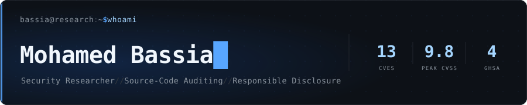

<div align="center">

<!-- Custom animated banner -->
<a href="https://github.com/0xBassia"></a>

<!-- Typing animation -->
<a href="https://github.com/0xBassia">
  
</a>

<br/>

<a href="https://github.com/advisories?query=credit%3A0xBassia"></a>
<a href="https://github.com/advisories?query=credit%3A0xBassia"></a>
<a href="https://github.com/advisories?query=credit%3A0xBassia"></a>
<a href="https://github.com/0xBassia?tab=followers"></a>

</div>

---

## `> whoami`

```bash
┌──(root㉿0xbassia)-[~]
└─# cat profile.txt

[+] Name........: Mohamed Bassia
[+] Role........: Security Researcher / Vulnerability Hunter
[+] Specialties.: Source-code auditing, 0-day discovery, web exploitation
[+] Bug classes.: Account takeover, RCE, SSRF, prototype pollution, XSS, IDOR
[+] Credits.....: 19 published CVEs (7 GitHub-reviewed + 12 WPScan)
[+] Advisories..: 4 additional GHSA credits without CVE assignment
[+] Peak........: CVE-2026-14560, CVSS 10.0
[+] Ecosystems..: npm, Go, WordPress, Joomla
[+] Status......: Reading code others trust, finding what they missed
```

## `> CVEs --published`

<div align="center">

**19 published CVEs** &nbsp;·&nbsp; peak severity **10.0 Critical** &nbsp;·&nbsp; npm, Go & WordPress &nbsp;·&nbsp; sorted by CVSS

</div>

| CVE | Target | Severity | Vulnerability Class | Published |
|:---|:---|:---|:---|:---|
| [CVE&#8209;2026&#8209;14560](https://wpscan.com/vulnerability/aba51906-91dc-4e75-ad44-373fe128deee) | `Teddy Bear Customize Addon` (<= 1.0.5) | 🟣&nbsp;Critical&nbsp;`10.0` | Unauthenticated arbitrary file upload to RCE | 2026&#8209;09&#8209;09 |
| [CVE&#8209;2026&#8209;14559](https://wpscan.com/vulnerability/90cbbed5-9662-4405-88b8-bd55854dccdf) | `Teddy Bear Customize Addon` (<= 1.0.5) | 🟣&nbsp;Critical&nbsp;`9.8` | Unauthenticated account takeover, password never verified | 2026&#8209;09&#8209;09 |
| [CVE&#8209;2026&#8209;14561](https://wpscan.com/vulnerability/4025601f-ed33-4772-b716-a9979830e10d) | `Authora - Easy Login with Mobile Number` (< 1.7.7) | 🟣&nbsp;Critical&nbsp;`9.8` | Unauthenticated account takeover via OTP disclosure | 2026&#8209;07&#8209;20 |
| [CVE&#8209;2026&#8209;46510](https://github.com/advisories/GHSA-m2hg-wjq3-28wq) | `form-data-objectizer` | 🔴&nbsp;High&nbsp;`8.2` | Prototype pollution via bracket-notation form keys | 2026&#8209;05&#8209;18 |
| [CVE&#8209;2026&#8209;45325](https://github.com/advisories/GHSA-cmxg-94mg-jq94) | `@tmlmobilidade/utils` | 🔴&nbsp;High&nbsp;`8.2` | Prototype pollution in `setValueAtPath` | 2026&#8209;05&#8209;18 |
| [CVE&#8209;2026&#8209;45302](https://github.com/advisories/GHSA-xp7r-j8r6-j9h3) | `parse-nested-form-data` | 🔴&nbsp;High&nbsp;`8.2` | Prototype pollution via `__proto__` in form fields | 2026&#8209;05&#8209;18 |
| [CVE&#8209;2026&#8209;46509](https://github.com/advisories/GHSA-x7q7-fchv-8h2j) | `@ranfdev/deepobj` | 🔴&nbsp;High&nbsp;`8.2` | Prototype pollution | 2026&#8209;05&#8209;14 |
| [CVE&#8209;2026&#8209;44483](https://github.com/advisories/GHSA-c567-44rc-m5hq) | `@rvf/set-get` | 🔴&nbsp;High&nbsp;`8.2` | Prototype pollution reachable via `@rvf/core` preprocessFormData | 2026&#8209;05&#8209;11 |
| [CVE&#8209;2026&#8209;14565](https://wpscan.com/vulnerability/613e5421-9da5-408a-b35d-b0def567e8db) | `Advanced Customized Prompts` (<= 1.0.1) | 🔴&nbsp;High&nbsp;`8.0` | Subscriber+ stored XSS via product popup configuration | 2026&#8209;09&#8209;09 |
| [CVE&#8209;2026&#8209;12516](https://wpscan.com/vulnerability/2ac80164-03b7-4966-b022-833b4194de80) | `Fediverse Embeds` (< 1.5.8) | 🔴&nbsp;High&nbsp;`7.5` | Unauthenticated SSRF via media proxy, full read + open proxy | 2026&#8209;06&#8209;18 |
| [CVE&#8209;2026&#8209;17533](https://wpscan.com/vulnerability/13b57cdc-d954-4db6-94c2-53ad04ab0d34) | `All-in-One WP Migration and Backup` (< 7.108) | 🔴&nbsp;High&nbsp;`7.2` | Network-wide PHP code execution from a multisite subsite admin | 2026&#8209;08&#8209;14 |
| [CVE&#8209;2026&#8209;9815](https://wpscan.com/vulnerability/043f449f-fc65-4218-83d2-7742e62f2af3) | `MagicForm` (<= 0.1.3) | 🔴&nbsp;High | Unauthenticated arbitrary file upload to RCE | 2026&#8209;05&#8209;28 |
| [CVE&#8209;2026&#8209;9067](https://wpscan.com/vulnerability/7fac98eb-f82c-4705-a956-aba650945826) | `Schema & Structured Data for WP & AMP` (< 1.60) | 🔴&nbsp;High | Unauthenticated arbitrary media upload | 2026&#8209;05&#8209;20 |
| [CVE&#8209;2026&#8209;12517](https://wpscan.com/vulnerability/460a996f-e27d-47e8-9d68-9e6be93100c0) | `Fediverse Embeds` (< 1.5.8) | 🟠&nbsp;Medium&nbsp;`5.3` | Unauthenticated SSRF via site-info endpoint | 2026&#8209;06&#8209;18 |
| [CVE&#8209;2026&#8209;14562](https://wpscan.com/vulnerability/890f55f9-0bd0-4816-a666-a735b41ce5c7) | `Teddy Bear Customize Addon` (<= 1.0.5) | 🟠&nbsp;Medium&nbsp;`5.3` | Unauthenticated order and attachment data disclosure | 2026&#8209;09&#8209;09 |
| [CVE&#8209;2026&#8209;47378](https://github.com/advisories/GHSA-4w6r-5c2j-qf5f) | `nocodb` | 🟠&nbsp;Medium | Hidden column exposure in public shared views | 2026&#8209;06&#8209;05 |
| [CVE&#8209;2026&#8209;55671](https://github.com/advisories/GHSA-29jh-8cfq-rr8x) | `zitadel/zitadel` (Go) | 🟢&nbsp;Low | SSRF and denylist bypass in outgoing HTTP components | 2026&#8209;06&#8209;18 |
| [CVE&#8209;2026&#8209;14563](https://wpscan.com/vulnerability/7c7ad196-dff3-485f-9a50-8705bd796fb3) | `Advanced Customized Prompts` (<= 1.0.1) | ⚪&nbsp;Unrated | Unauthenticated account takeover, password never verified | 2026&#8209;09&#8209;09 |
| [CVE&#8209;2026&#8209;14566](https://wpscan.com/vulnerability/01094477-a9ad-41d9-9acd-f6ed37e6e605) | `Advanced Customized Prompts` (<= 1.0.1) | ⚪&nbsp;Unrated | Subscriber+ WooCommerce order metadata tampering (IDOR) | 2026&#8209;09&#8209;09 |

<div align="center">

<sub>🟣 Critical &nbsp;·&nbsp; 🔴 High &nbsp;·&nbsp; 🟠 Medium &nbsp;·&nbsp; 🟢 Low &nbsp;·&nbsp; ⚪ Unrated, no CVSS published by the advisory source</sub>

<sub>7 GitHub-reviewed CVEs (6 npm + 1 Go) credited via the <a href="https://github.com/advisories?query=credit%3A0xBassia">GitHub Advisory Database</a> &nbsp;·&nbsp; 12 WordPress CVEs disclosed through <a href="https://wpscan.com/vulnerability/043f449f-fc65-4218-83d2-7742e62f2af3">WPScan</a></sub>

</div>

## `> advisories --credited`

<div align="center">

**4 published GitHub Security Advisories** &nbsp;·&nbsp; credited as reporter, no CVE assigned

</div>

| Advisory | Target | Severity | Vulnerability Class | Published |
|:---|:---|:---|:---|:---|
| [GHSA&#8209;mrf2&#8209;rxph&#8209;r28h](https://github.com/Kunena/Kunena-Forum/security/advisories/GHSA-mrf2-rxph-r28h) | `Kunena Forum` (<= 7.0.4) | 🔴&nbsp;High&nbsp;`8.2` | Unauthenticated attachment privacy modification, missing CSRF and authorization | 2026&#8209;05&#8209;18 |
| [GHSA&#8209;wfph&#8209;gf24&#8209;pjqg](https://github.com/Kunena/Kunena-Forum/security/advisories/GHSA-wfph-gf24-pjqg) | `Kunena Forum` (<= 7.0.4) | 🟠&nbsp;Medium&nbsp;`4.3` | Missing CSRF token check on the topic rating endpoint | 2026&#8209;05&#8209;18 |
| [GHSA&#8209;px35&#8209;hwj4&#8209;wqrh](https://github.com/Kunena/Kunena-Forum/security/advisories/GHSA-px35-hwj4-wqrh) | `Kunena Forum` (<= 7.0.4) | 🟢&nbsp;Low&nbsp;`3.5` | Arbitrary-user avatar overwrite via missing CSRF check | 2026&#8209;05&#8209;18 |
| [GHSA&#8209;354h&#8209;gmhv&#8209;mr9c](https://github.com/TryGhost/Ghost/security/advisories/GHSA-354h-gmhv-mr9c) | `TryGhost/Ghost` (< 6.27.0) | 🟢&nbsp;Low&nbsp;`2.7` | SSRF in webhook trigger (CWE-918) | 2026&#8209;08&#8209;11 |

## `> arsenal --list`

<div align="center">

**Source-Code Auditing & SAST**

[](https://codeql.github.com)
[](https://semgrep.dev)
[](https://www.sonarsource.com)
[](https://owasp.org/www-project-code-review-guide/)

**Vulnerability Research & Exploitation**

[](https://portswigger.net/burp)
[](https://github.com/Gallopsled/pwntools)
[](https://ghidra-sre.org)
[](https://frida.re)

**Fuzzing & Supply-Chain**

[](https://github.com/AFLplusplus/AFLplusplus)
[](https://llvm.org/docs/LibFuzzer.html)
[](https://github.com/google/osv-scanner)
[](https://docs.npmjs.com/cli/commands/npm-audit)

**Languages**

[](https://www.python.org)
[](https://developer.mozilla.org/en-US/docs/Web/JavaScript)
[](https://www.typescriptlang.org)
[](https://go.dev)
[](https://www.php.net)
[](https://en.cppreference.com/w/c)
[](https://www.gnu.org/software/bash/)

</div>

## `> stats --github`

<div align="center">

<a href="https://github.com/0xBassia"></a>
<a href="https://github.com/0xBassia"></a>

<a href="https://github.com/0xBassia"></a>
<a href="https://github.com/0xBassia"></a>

</div>

## `> achievements --unlock`

<div align="center">

**Research:** &nbsp; 🛡️ 19 published CVEs &nbsp;·&nbsp; 📜 4 GHSA advisory credits &nbsp;·&nbsp; 🎯 peak 10.0 Critical

**GitHub:** &nbsp; 🦈 Pull Shark ×2 &nbsp;·&nbsp; ⚡ Quickdraw &nbsp;·&nbsp; 👥 Pair Extraordinaire &nbsp;·&nbsp; 🧊 Arctic Code Vault

</div>

## `> contact --secure`

<div align="center">

<a href="mailto:0xbassia@gmail.com"></a>
<a href="https://github.com/0xBassia"></a>

<sub><code>root@0xbassia:~# echo "Hack the planet, responsibly."</code> <code>█</code></sub>

</div>
